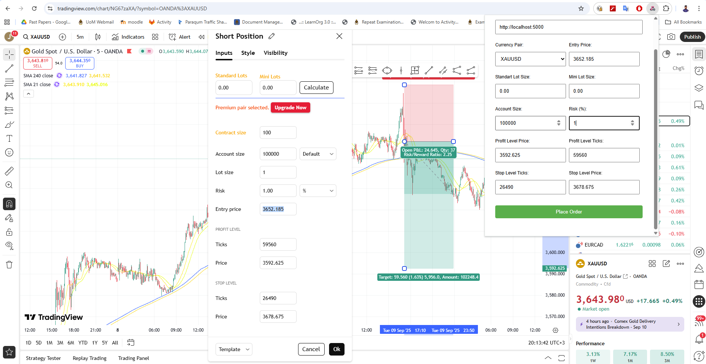

# One Click Trading Chrome Extension

A Chrome extension that allows traders to quickly place orders from TradingView charts with a single click, streamlining the trading workflow by automatically extracting trading parameters and sending them to a webhook API.



## Features

- **One-Click Order Placement**: Place trades directly from TradingView charts without manual data entry
- **Automatic Data Extraction**: Automatically extracts trading parameters from TradingView's order dialog
- **Webhook Integration**: Sends order data to your custom webhook API endpoint
- **Multiple Currency Pairs**: Supports major forex pairs, commodities (XAUUSD), and cryptocurrencies (BTCUSD)
- **Persistent Settings**: Remembers your webhook URL across sessions
- **Data Validation**: Confirms order details before sending

## Supported Trading Parameters

The extension automatically extracts the following data from TradingView:

- Currency Pair
- Standard Lot Size
- Mini Lot Size
- Account Size
- Risk Percentage
- Entry Price
- Profit Level (Ticks & Price)
- Stop Level (Ticks & Price)

## Supported Currency Pairs

### Major Forex Pairs
- EURUSD, USDJPY, GBPUSD, AUDUSD
- USDCAD, USDCHF, NZDUSD

### Cross Currency Pairs
- EURCHF, EURGBP, EURCAD, EURAUD, EURNZD, EURJPY
- GBPJPY, GBPCHF, GBPAUD, GBPCAD, GBPNZD
- AUDCHF, AUDCAD, AUDNZD, CADCHF

### Commodities & Crypto
- XAUUSD (Gold)
- BTCUSD (Bitcoin)

## Installation

1. **Download the Extension**
   - Clone or download this repository
   - Extract the files to a local directory

2. **Load in Chrome**
   - Open Chrome and navigate to `chrome://extensions/`
   - Enable "Developer mode" in the top right corner
   - Click "Load unpacked" and select the `one-click-trading` folder
   - The extension should now appear in your extensions list

3. **Pin the Extension**
   - Click the puzzle piece icon in Chrome's toolbar
   - Find "One Click Trade" and click the pin icon to keep it visible

## Usage

1. **Setup Webhook URL**
   - Click the extension icon in your browser toolbar
   - Enter your webhook API endpoint URL
   - The URL will be saved automatically for future use

2. **Open TradingView**
   - Navigate to [TradingView.com](https://www.tradingview.com)
   - Open the chart for your desired currency pair
   - Open the order dialog (usually by clicking on the chart or using a trading panel)

3. **Place an Order**
   - Fill in your trading parameters in TradingView's order dialog
   - Click the "One Click Trade" extension icon
   - Review the extracted data in the popup
   - Click "Place Order" to send the data to your webhook

## API Integration

The extension sends a POST request to your webhook URL with the following JSON structure:

```json
{
  "currencyPair": "EURUSD",
  "standartLotSize": "100000",
  "miniLotSize": "10000",
  "accountSize": "10000",
  "risk": "0.50",
  "entryPrice": "1.0850",
  "profitLevelTicks": "50",
  "profitLevelPrice": "1.0900",
  "stopLevelTicks": "25",
  "stopLevelPrice": "1.0825"
}
```

### Headers
- `Content-Type: application/json`
- `x-api-key: [Your API Key]`

## File Structure

```
one-click-trading/
├── manifest.json          # Extension configuration
├── background.js          # Service worker for API calls
├── content.js            # Script injected into TradingView
├── popup.html            # Extension popup interface
├── popup.js              # Popup functionality
├── styles.css            # Popup styling
└── icons/                # Extension icons
    ├── icon16.png
    ├── icon32.png
    ├── icon48.png
    └── icon128.png
```

## Permissions

The extension requires the following permissions:

- `activeTab`: To interact with the current TradingView tab
- `scripting`: To inject content scripts
- `tabs`: To communicate with tabs
- `storage`: To save webhook URL settings

## Development

### Prerequisites
- Chrome browser
- Basic knowledge of Chrome extension development

### Making Changes
1. Modify the relevant files in the `one-click-trading` directory
2. Go to `chrome://extensions/`
3. Click the refresh icon on your extension to reload changes
4. Test your changes on TradingView

### Key Files to Modify
- `content.js`: Update selectors if TradingView changes their UI
- `popup.js`: Modify the data structure or add new fields
- `background.js`: Update API integration logic
- `styles.css`: Customize the popup appearance

## Troubleshooting

### Extension Not Working
- Ensure you're on a TradingView.com page
- Check that the order dialog is open in TradingView
- Verify the extension is enabled in `chrome://extensions/`

### Data Not Extracting
- TradingView may have updated their UI - check the selectors in `content.js`
- Ensure all required fields are filled in the TradingView order dialog

### API Errors
- Verify your webhook URL is correct and accessible
- Check that your API endpoint accepts POST requests with JSON data
- Ensure your API key is valid

## Security Notes

- The extension includes a hardcoded API key in `background.js` - consider implementing a more secure authentication method for production use
- All data is sent over HTTPS when using secure webhook URLs
- The extension only operates on TradingView.com domains

## Contributing

1. Fork the repository
2. Create a feature branch
3. Make your changes
4. Test thoroughly on TradingView
5. Submit a pull request

## License

Copyright © 2025 LesleyJJ. All rights reserved.

## Disclaimer

This extension is for educational and personal use. Always verify trading data before placing real trades. The authors are not responsible for any financial losses incurred through the use of this extension.

---

> ⚠️ **Note:** The full source code is not publicly available. If you are interested in accessing the source code or collaborating, please [contact me](mailto:jacobjohnlesley@gmail.com).
